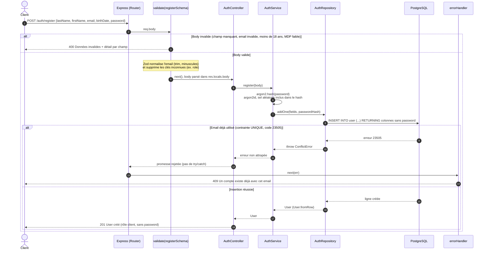

# 1. Enregistrement : `POST /api/v1/auth/register`

Le mot de passe est haché (argon2id) dans le service. La base ne voit jamais le mot de passe en clair, et la réponse ne le contient jamais.

```mermaid
sequenceDiagram
    autonumber
    actor C as Client
    participant X as Express (Router)
    participant V as validate(registerSchema)
    participant AC as AuthController
    participant AS as AuthService
    participant AR as AuthRepository
    participant DB as PostgreSQL
    participant EH as errorHandler

    C->>X: POST /auth/register {lastName, firstName, email, birthDate, password}
    X->>V: req.body
    alt Body invalide (champ manquant, email invalide, moins de 18 ans, MDP faible)
        V-->>C: 400 Données invalides + détail par champ
    else Body valide
        Note over V: Zod normalise l'email (trim, minuscules)<br/>et supprime les clés inconnues (ex. role)
        V->>AC: next(), body parsé dans res.locals.body
        AC->>AS: register(body)
        AS->>AS: argon2.hash(password)<br/>argon2id, sel aléatoire inclus dans le hash
        AS->>AR: addOne(fields, passwordHash)
        AR->>DB: INSERT INTO user (...) RETURNING colonnes sans password
        alt Email déjà utilisé (contrainte UNIQUE, code 23505)
            DB-->>AR: erreur 23505
            AR-->>AS: throw ConflictError
            AS-->>AC: erreur non attrapée
            AC-->>X: promesse rejetée (pas de try/catch)
            X->>EH: next(err)
            EH-->>C: 409 Un compte existe déjà avec cet email
        else Insertion réussie
            DB-->>AR: ligne créée
            AR-->>AS: User (User.fromRow)
            AS-->>AC: User
            AC-->>C: 201 User créé (rôle client, sans password)
        end
    end
```
