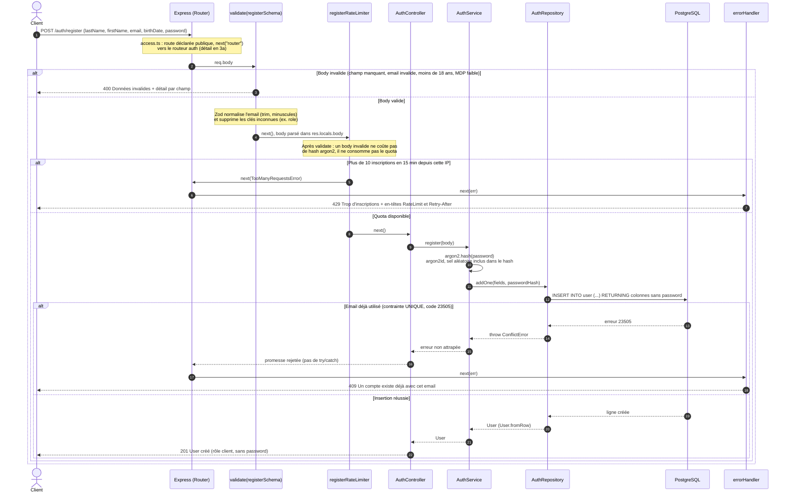

# 1. Enregistrement : `POST /api/v1/auth/register`

```mermaid
sequenceDiagram
    autonumber
    actor C as Client
    participant X as Express (Router)
    participant V as validate(registerSchema)
    participant RL as registerRateLimiter
    participant AC as AuthController
    participant AS as AuthService
    participant AR as AuthRepository
    participant DB as PostgreSQL
    participant EH as errorHandler

    C->>X: POST /auth/register {lastName, firstName, email, birthDate, password}
    Note over X: access.ts : route déclarée publique, next("router")<br/>vers le routeur auth (détail en 3a)
    X->>V: req.body
    alt Body invalide (champ manquant, email invalide, moins de 18 ans, MDP faible)
        V-->>C: 400 Données invalides + détail par champ
    else Body valide
        Note over V: Zod normalise l'email (trim, minuscules)<br/>et supprime les clés inconnues (ex. role)
        V->>RL: next(), body parsé dans res.locals.body
        Note over RL: Après validate : un body invalide ne coûte pas<br/>de hash argon2, il ne consomme pas le quota
        alt Plus de 10 inscriptions en 15 min depuis cette IP
            RL->>X: next(TooManyRequestsError)
            X->>EH: next(err)
            EH-->>C: 429 Trop d'inscriptions + en-têtes RateLimit et Retry-After
        else Quota disponible
            RL->>AC: next()
            AC->>AS: register(body)
            AS->>AS: argon2.hash(password)<br/>argon2id, sel aléatoire inclus dans le hash
            AS->>AR: addOne(fields, passwordHash)
            AR->>DB: INSERT INTO user (...) RETURNING colonnes sans password
            alt Email déjà utilisé (contrainte UNIQUE, code 23505)
                DB-->>AR: erreur 23505
                AR-->>AS: throw ConflictError
                AS-->>AC: erreur non attrapée
                AC-->>X: promesse rejetée (pas de try/catch)
                X->>EH: next(err)
                EH-->>C: 409 Un compte existe déjà avec cet email
            else Insertion réussie
                DB-->>AR: ligne créée
                AR-->>AS: User (User.fromRow)
                AS-->>AC: User
                AC-->>C: 201 User créé (rôle client, sans password)
            end
        end
    end
```
