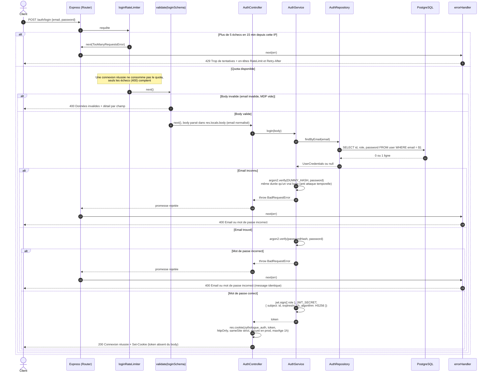

# 2. Identification : `POST /api/v1/auth/login`

La preuve d'identification (JWT signé) est déposée dans un cookie `httpOnly` : elle n'apparaît jamais dans le body, et le JavaScript du navigateur ne peut pas la lire.

