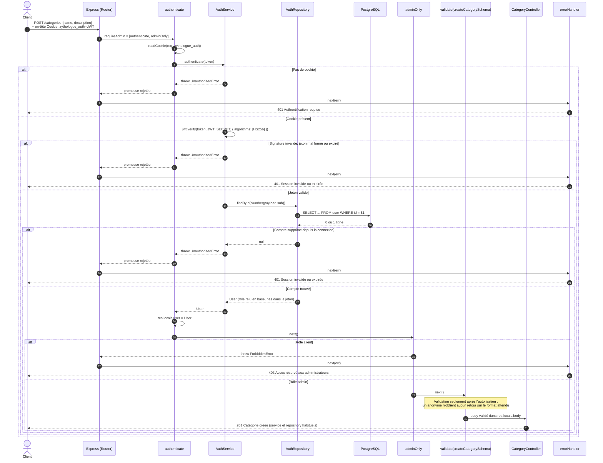
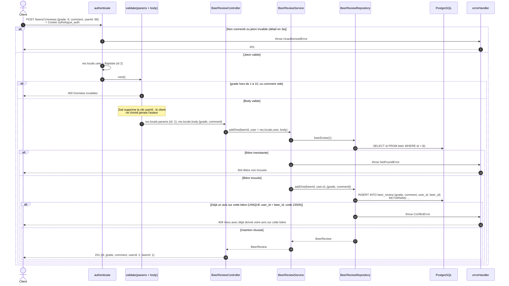
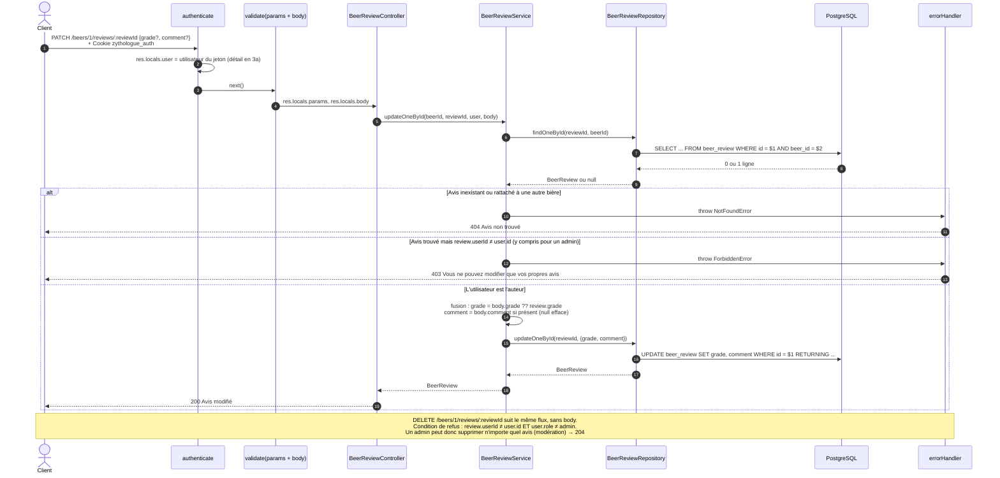

# 3. Autorisation : lecture et écriture d'une ressource

Quatre niveaux d'accès :

| Niveau | Qui | Exemples | Vérifié par |
|---|---|---|---|
| Public | tout le monde | tous les `GET` du catalogue, `GET /beers/:id/reviews` | aucun middleware |
| Connecté | tout compte avec un jeton valide | `POST /beers/:id/reviews`, `GET /auth/me` | middleware `authenticate` |
| Admin | rôle `admin` | écriture du catalogue, `GET /beer-logs` | `requireAdmin` = `[authenticate, adminOnly]` |
| Propriétaire | l'auteur de la donnée (ou un admin pour la suppression) | `PATCH` / `DELETE /beers/:id/reviews/:reviewId` | `BeerReviewService` (règle métier) |

Codes d'erreur : **401** signifie « je ne sais pas qui tu es » (pas de jeton, jeton invalide ou expiré). **403** signifie « je sais qui tu es, mais tu n'as pas le droit ».

---

## 3a. Le middleware `authenticate` + `requireAdmin` (écriture dans le catalogue)

Exemple : `POST /api/v1/categories`. Le même enchaînement protège tous les `POST`, `PATCH` et `DELETE` du catalogue.

---

## 3b. Création d'un avis : l'écriture porte l'utilisateur du jeton

Exemple : Baptiste (client, id 2) note la bière 1 et tente de se faire passer pour l'utilisateur 99.

> Pour la lisibilité, les erreurs sont dessinées directement vers `errorHandler`. Le chemin réel est le même qu'en 3a : throw, puis promesse rejetée dans le controller, puis `next(err)` par Express.

---

## 3c. Modification et suppression d'un avis : la règle du propriétaire

La route ne vérifie que l'identité (`authenticate`). Savoir si l'avis t'appartient demande de **le lire en base** : ce contrôle est donc une règle métier, écrite dans le service.

